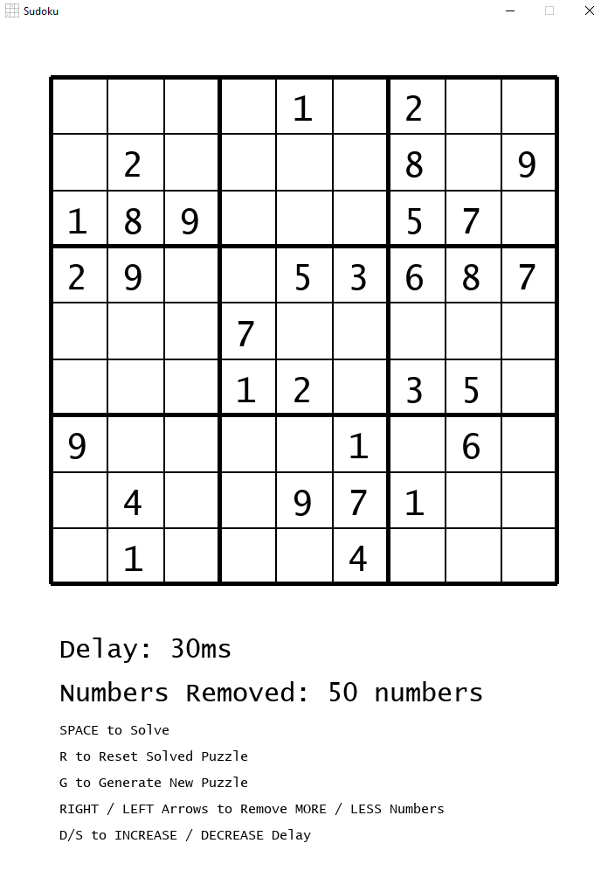
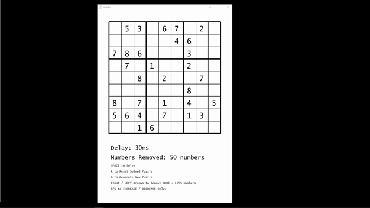

# Sudoku Visualizer

This a project which allows the user to generate a sudoku puzzle and solve the puzzle using a backtracking algorithm. The application allows the user to choose how many
numbers are removed from the puzzle, creating varying degrees of difficulty in puzzles. 

The user may also choose to increase/decrease delay which dictates how fast the program solves the puzzle, with a lower delay resulting in a faster result.
The current puzzle may be reset by pressing 'r' and a new puzzle will be generated by pressing 'g'. Note: The program will not reset or generate a new puzzle
while active.
The program may begin its solving by pressing 'space'.

**This program makes use of the PyGame library and will not function without it**
   
# A picture of the application locally with PyGame installed.

   
# Below is a Short GIF of the application in action
The delay is toggled, then the number of numbers removed. Next new puzzles are generated and then the backtracking algorithm is run. Finally the puzzle is reset.
  

